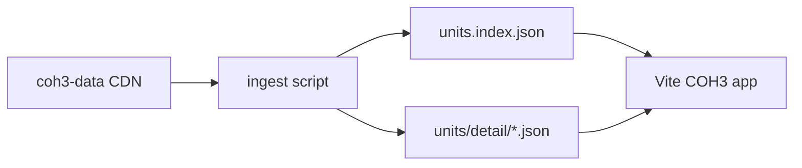

## Context

**coh3-data** (CDN pattern):

```text
https://data.coh3stats.com/cohstats/coh3-data/${dataTag}/data/${dataFile}
```

Relevant files (full or chunked):

| File | Role |
|------|------|
| `chunked/sbps/races/{race}.json` | Squads/units by race; categories: `infantry`, `vehicles`, `team_weapons`, `emplacements`, `aircraft` |
| `ebps.json` | Entity blueprints (per-entity extensions: health, armor, weapons, sight, …) |
| `weapon.json` | Weapon stats linked from entities |
| `upgrade.json` | Upgrades (later milestone) |
| `abilities.json` | Abilities (later milestone) |
| `locstring.json` | Numeric id → display string |
| `locales/` | i18n overlays (v2: hub languages) |

Races in data: `american`, `german`, `british`, `afrika_korps`, `british_africa`, `common` (filter `common` from player-facing faction list unless needed for shared parents).

**coh3-stats** is the reference for *which* files matter and how community names factions; we do **not** port Mantine/theme/layout.

## Goals / Non-Goals

**Goals:**

- **Accuracy:** Values traceable to coh3-data JSON and `dataTag`.
- **Simplest UX** for v1: faction + category + search → one unit page with **exhaustive spec listing**.
- **Filter model** that scales to international audience (English first, locale-ready keys).
- **Performance:** ship precomputed index; load detail shard on demand.

**Non-Goals (v1):**

- Copying coh3stats.com CSS, charts, or page chrome.
- Relic API / live match stats.
- Chatbot, battlegroup builder, counter tables, DPS calculators.
- Perfect in-game tooltip parity (stretch goal after raw listing works).

## Decisions

### D1 — Source of truth

**Decision:** Pin `dataTag` in `coh3/data-tag.json` (or env); ingest at **build time** via script.

**Rationale:** Avoids CORS surprises, guarantees deploy matches a known patch, enables static hosting on S3. coh3-data documents this CDN contract explicitly.

### D2 — Unit identity

**Decision:** Primary key = `{race}/{category}/{unitKey}` where `unitKey` is the property name in `sbps` JSON (e.g. `artillery_observers_us`). Store `pbgid` when present for cross-links.

**Rationale:** Stable across UI routes; matches data shape engineers already know from cohstats tooling.

### D3 — Normalization strategy (v1 pragmatic)

**Decision:** Two-layer model:

1. **`UnitSummary`** — id, faction, category, `displayName`, `iconRef` (if resolved), tags (`squad_type`, population, etc.) via **known extension paths** (health, armor, weapon refs, upkeep).
2. **`UnitSpecSections[]`** — grouped key/value tables generated by **walking** `extensions` / `squadexts` with extension type as section header; resolve locstring ids where values are references.

**Rationale:** Guarantees “list all specs” without waiting for a complete typed parser. Align later with `coh3-data-types-library` field extractors where they exist.

### D4 — Weapons and entities

**Decision:** Follow `squad_loadout_ext` / entity refs from squad → fetch matching nodes in `ebps` and `weapon.json`; attach as nested sections on detail page.

**Rationale:** Players care about HP, armor, and weapons; those live across sbps + ebps + weapon.

### D5 — UX information architecture (simplest path)

```text
/coh3                          → hub intro + data version + faction grid
/coh3/units?faction=german&category=infantry
/coh3/units/{faction}/{category}/{unitKey}   → full spec
```

**In-page controls (single list view):**

1. **Faction** (required): horizontal chips — Wehrmacht, US Forces, British, DAK, etc. (map from race keys + locstring).
2. **Category** (required): tabs — Infantry | Vehicles | Team Weapons | Emplacements | Aircraft.
3. **Search** (optional): filters current list by `displayName` / `unitKey` (client-side on index).
4. **Unit row:** name + 2–3 high-signal stats (cost, pop, HP) once extractors exist; v0 can be name-only.
5. **Detail:** accordion or stacked tables per extension; toggle **“Show raw JSON”** for debugging and analysis articles.

**Rationale:** Matches mental model of RTS players (faction → unit type → pick unit). No nested menus beyond three levels.

### D6 — Filtering rules

| Filter | Source field | Notes |
|--------|----------------|-------|
| Faction | `race` file name | Exclude `common` from default picker |
| Category | top-level key under race object | Fixed enum from data |
| Text search | `displayName`, `unitKey` | Debounced client filter |
| Hide non-buildable (future) | `requirement_ext` / game mode flags | Out of v1 unless trivial |

### D7 — Attribution UI

**Decision:** Footer on all `/coh3/*` pages: “Unit data from [COH3 Stats Open Data](https://coh3stats.com/other/open-data) · patch `{dataTag}`”.

## Risks / Trade-offs

| Risk | Mitigation |
|------|------------|
| Raw JSON huge / slow | Chunked race files + generated per-unit detail shards at build |
| Locstring ids missing | Fallback to `unitKey`; log in build report |
| Patch drift | CI fails if `dataTag` fetch 404; manual bump tag on game updates |
| Over-normalization too slow | Ship walker first; refine high-value fields incrementally |
| License / attribution | Follow coh3-data README shoutout |

## Data flow (v1)



## Future expansion (not v1)

- i18n via `locales/` + hub language switcher.
- Chatbot: RAG over normalized shards + your `analysis` articles.
- Compare mode (two units side-by-side).
- Visualization: Three.js icons / range rings using extracted sight/weapon range.
